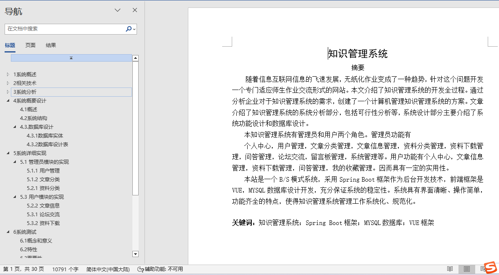
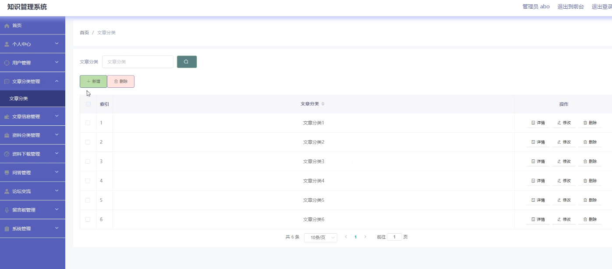
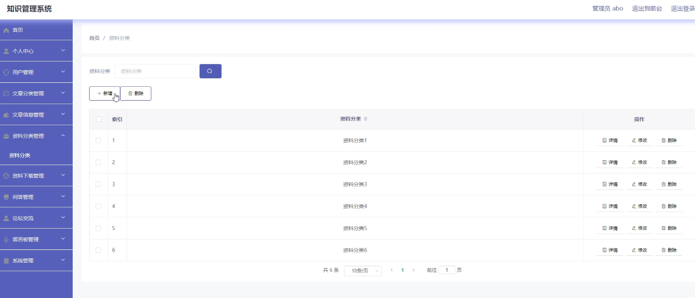
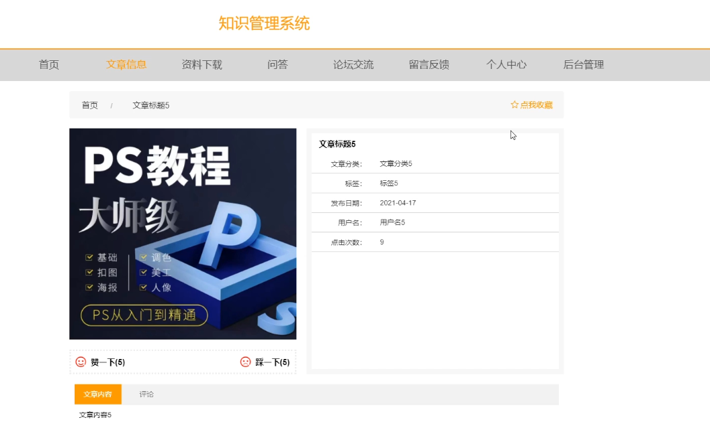
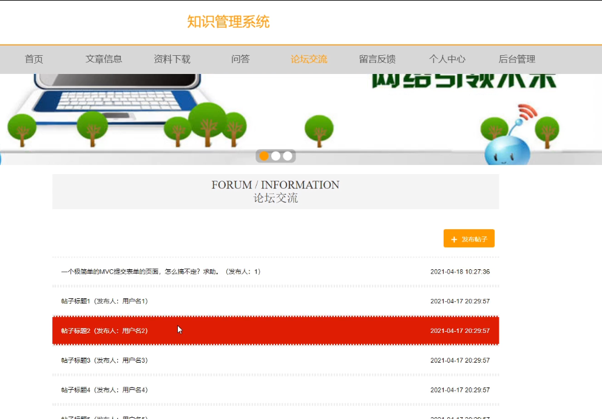
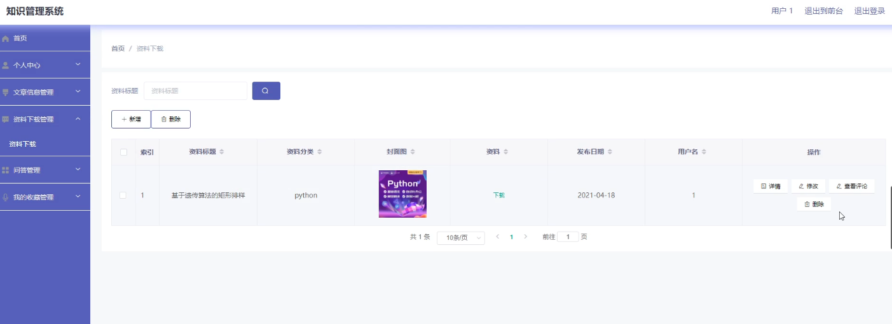
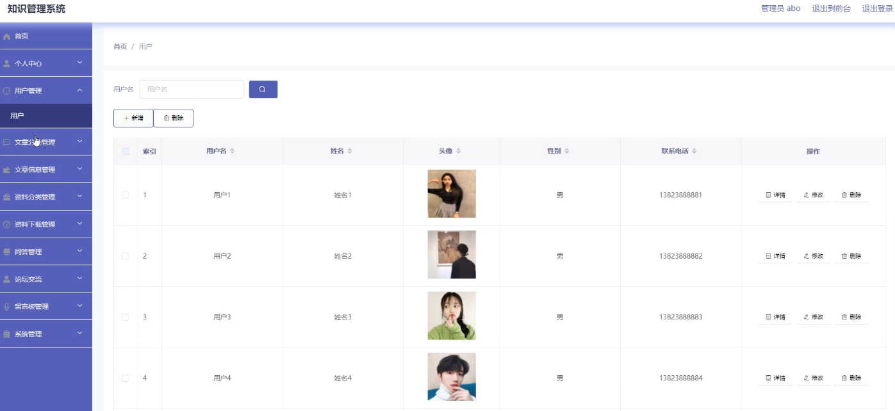

## 知识管理系统(程序+报告)

- <b>完整代码获取地址：从戎源码网 ([https://armycodes.com/](https://armycodes.com/))</b>
- <b>技术探讨、资料分享，请加QQ群：692619798</b> 
- <b>作者微信：19941326836  QQ：952045282</b> 
- <b>承接计算机毕业设计、Java毕业设计、Python毕业设计、深度学习、机器学习</b>
- <b>选题+开题报告+任务书+程序定制+安装调试+论文+答辩ppt 一条龙服务</b>
- <b>所有选题地址 ([https://github.com/YuLin-Coder/AllProjectCatalog](https://github.com/YuLin-Coder/AllProjectCatalog)) </b>

## 项目介绍
知识管理系统，系统包含两种角色：用户、管理员，系统分为前台和后台两大模块，主要功能如下：

1 管理员模块的实现
- 用户管理: 管理员可以进行用户的新增、修改、删除和查询操作，以管理系统中的用户信息。
- 文章分类: 管理员可以对文章进行分类，包括新增、修改、删除和查询文章分类信息。
- 资料分类: 管理员可以管理资料分类信息，包括新增、修改、删除和查询操作。

2 用户模块的实现
- 文章信息: 用户可以在首页查看文章信息，并可以对感兴趣的文章进行收藏。
- 论坛交流: 用户可以在论坛中发布和查看信息，发布信息需要先登录系统。
- 资料下载: 用户可以在后台管理系统中进行资料的添加、修改、删除操作，并可以查看下载信息和评论。

## 项目技术
- 编程语言：Java
- 数据库：MySQL
- 项目管理工具：Maven
- 前端技术：HTML、CSS、JavaScript、Vue
- 后端技术：Spring、SpringMVC、MyBatis

## 运行环境
- JDK版本：JDK1.8及以上
- 开发工具：IDEA、Ecplise、Myecplise都可以
- 数据库: MySQL5.7及以上
- Maven：maven3.0及以上
- Node：14.14.0及以上

## 运行截图

